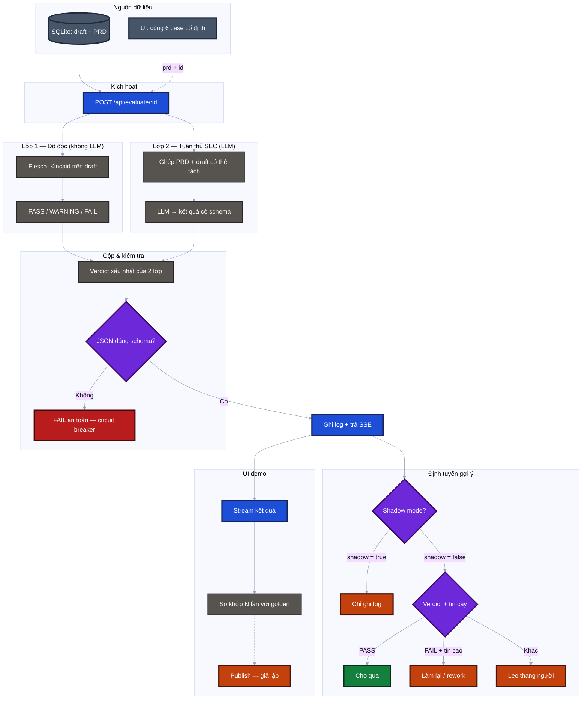
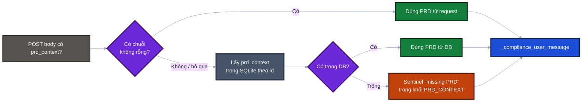
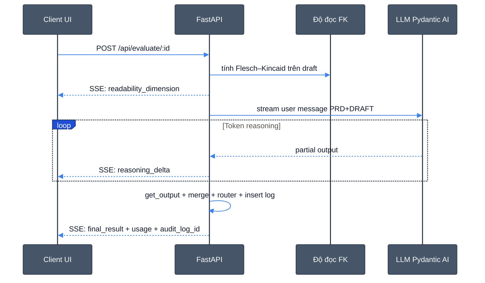
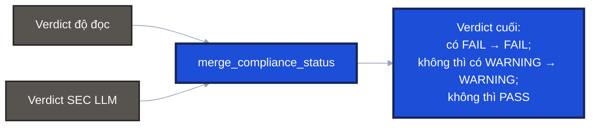
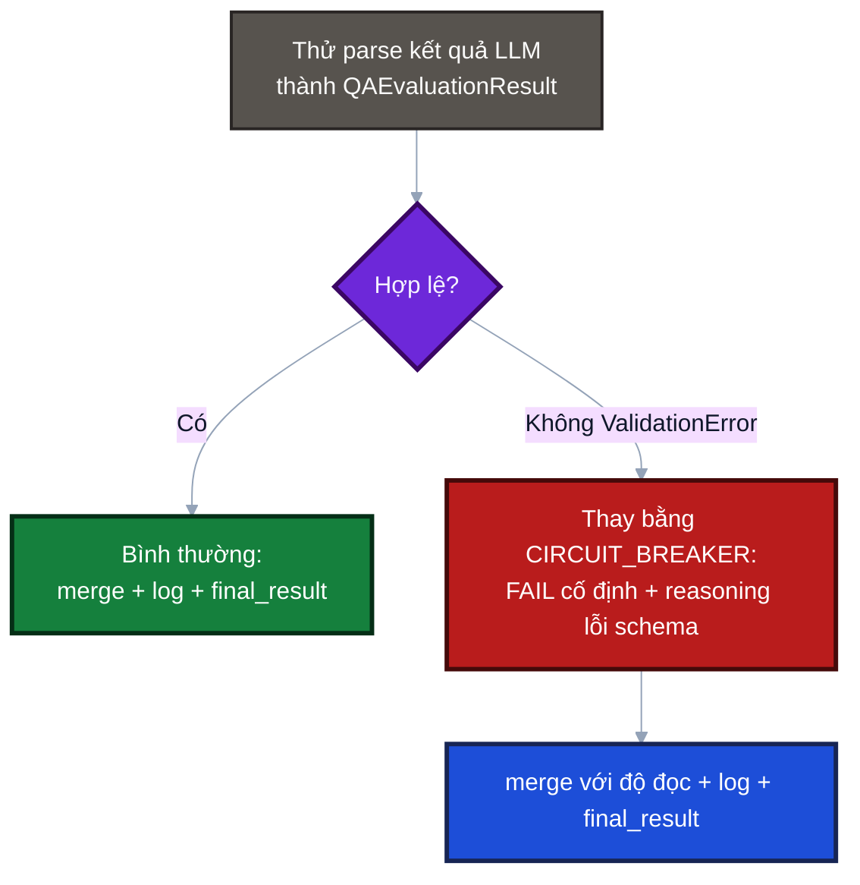
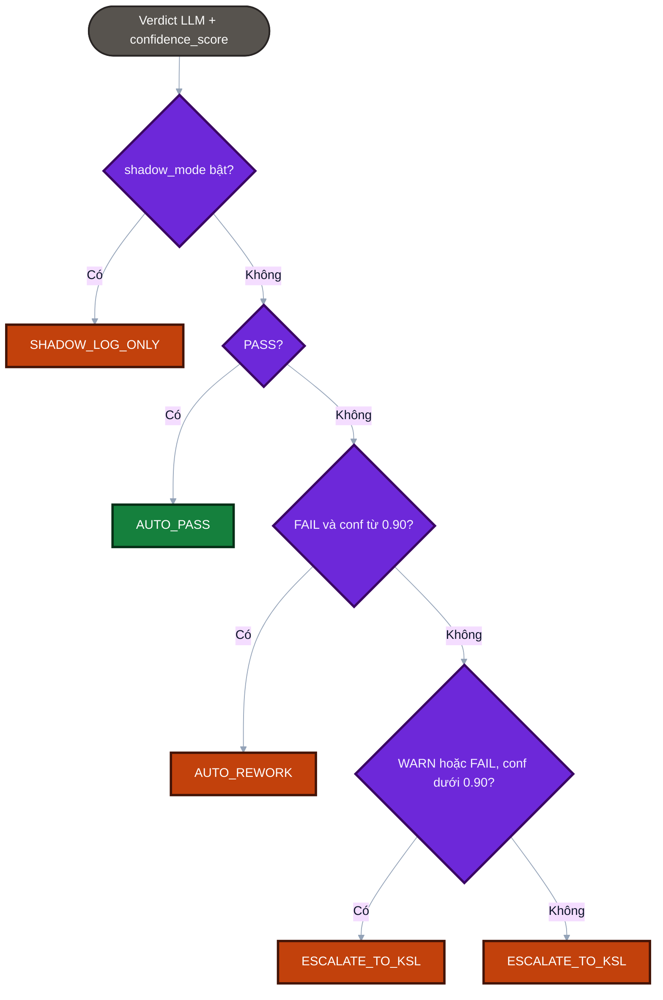
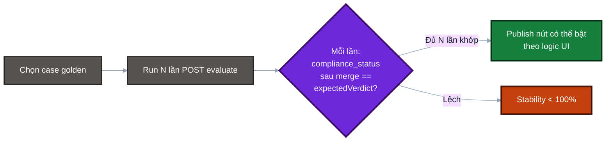
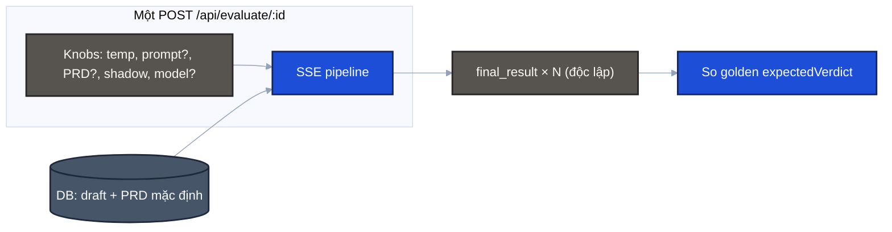

# ai-agents-qa

**Độc giả:** Architecture lead / quyết định ranh giới hệ thống.

**Gợi ý công cụ AI:** Repo có thể **khởi tạo và phát triển** với mọi **AI coding IDE** (ví dụ [Cursor](https://cursor.com), VS Code + Copilot, Windsurf, …), **AI CLI** (Codex, Claude Code, …), và **Model Chat UI** (ChatGPT, Claude, Gemini, …) — tùy quy trình team. Không bắt buộc công cụ nào để **chạy** PoC: chỉ cần Node + Python như [Yêu cầu hệ thống](#yêu-cầu-hệ-thống).

Đây là **PoC (proof of concept)**: một dịch vụ nhỏ giúp **soát câu chữ trong tài liệu** (draft) khi đã có **mô tả kỹ thuật** (PRD/spec), trong bối cảnh **SEC Rule 17a-4** và lưu trữ bất biến (WORM). Mục tiêu là thử nghiệm **một lớp “gatekeeper” bằng LLM** có output có cấu trúc, chứ **không** thay thế pháp lý, DLP, hay hệ thống lưu trữ thật.

Tài liệu chi tiết cho kỹ sư: [docs/A2A_OVERVIEW.md](docs/A2A_OVERVIEW.md).

---

## Cập nhật gần đây (UI & API)


| Thay đổi                | Chi tiết                                                                                                                                                                                                                                                       |
| ----------------------- | -------------------------------------------------------------------------------------------------------------------------------------------------------------------------------------------------------------------------------------------------------------- |
| **Chọn model OpenAI**   | Tab Evaluation: mỗi Variant có dropdown model (danh sách khớp allowlist backend). Mặc định `**gpt-4o`**. POST `/api/evaluate/{id}` gửi field JSON `**model`** (alias Pydantic: `openai_model`).                                                                |
| **Config OpenAI key**   | Thanh header (cạnh Runs / A/B): nút **Config OpenAI key** mở modal nhỏ — key lưu **localStorage** (`ai-agents-qa.openai_api_key`), gửi kèm header `**X-OpenAI-API-Key`** khi evaluate. Không lưu key → backend dùng `**OPENAI_API_KEY`** trong `backend/.env`. |
| **Stability score**     | Sau khi chạy đủ N lần: ngoài % khớp golden, hiển thị phần còn lại theo **WARNING / FAIL / other** (tỉ lệ và x/N). Emoji tổng hợp: có FAIL → 🔴; chỉ WARN/other → 🟡; toàn khớp → 🟢.                                                                           |
| **Evaluation — layout** | Tiêu đề case lớn hơn; **Steps** và **Expected** xếp **một cột** (không chia hai cột).                                                                                                                                                                          |
| **Evaluation trace**    | Khối audit chi tiết (Test meta, gates, telemetry) có thể **gấp / mở** (`<details>`) trong từng Variant.                                                                                                                                                        |
| **Tab Data Contracts**  | Mô tả schema `**QAEvaluationResult`**; ghi rõ SSE `**final_result`** còn merge thêm `readability_dimension`, `routing_decision`, `llm_*` qua `_evaluate_response_payload` trong `backend/main.py`.                                                             |
| **Schema LLM**          | `**QAEvaluationResult`** chỉ có 5 field: `evidence_quote`, `reasoning`, `is_ui_description`, `compliance_status`, `confidence_score` — **không** có `is_audit_caveat_missing` (nếu cần phải mở rộng Pydantic + prompt).                                        |


---

## Phạm vi: làm gì / chưa làm gì


| Đã có trong PoC                                             | Chưa có                                          |
| ----------------------------------------------------------- | ------------------------------------------------ |
| API đánh giá một draft + PRD, trả verdict có schema         | Chuỗi CI/CD, duyệt đa cấp, ticket Freshdesk thật |
| Hai “thước đo”: **tuân thủ (LLM)** + **độ đọc (công thức)** | Saga, rollback tự động, bù transaction           |
| SQLite + log audit tối thiểu                                | HA, multi-tenant production, IAM đầy đủ          |
| UI demo: bộ **6 tình huống vàng**, chạy lặp N lần           | “Publish” chỉ là **placeholder** trên UI         |


---

## Kiến trúc (4 thành phần)

1. **Trình duyệt (Next.js)** — chọn scenario, gọi API, xem kết quả stream.
2. **API (FastAPI)** — nhận request, gọi LLM, gộp kết quả, ghi log.
3. **CSDL nhẹ (SQLite)** — bảng case mẫu + log lần chạy.
4. **LLM (OpenAI qua Pydantic AI)** — điền form kết quả cố định (PASS / WARNING / FAIL, lý do, trích dẫn).

Luồng **một chiều theo request**: client gọi → server xử lý → trả stream → kết thúc. Không có hàng đợi, không orchestrator dài.

---

## Luồng xử lý (5 bước, ngôn ngữ đơn giản)

1. **Lấy dữ liệu:** Draft (đoạn cần soát) + PRD (bối cảnh đúng/sai) — từ DB hoặc do UI gửi kèm.
2. **Đo độ đọc** (máy, không LLM): điểm Flesch–Kincaid trên draft → PASS / WARNING / FAIL “đọc được”.
3. **Soát tuân thủ** (LLM): cùng một draft được đặt cạnh PRD trong hai khối văn bản tách biệt (`PRD_CONTEXT`, `DRAFT`) để model không lẫn **hướng dẫn hệ thống** với **nội dung cần chấm**.
4. **Gộp:** Lấy verdict **xấu nhất** giữa bước 2 và 3 (FAIL > WARNING > PASS).
5. **Trả về + ghi log:** Stream kết quả về client; ghi một dòng log; gắn nhãn **định tuyến gợi ý** (xem dưới). Nếu LLM trả JSON sai schema → dùng **circuit breaker** (một kết quả FAIL an toàn có sẵn), vẫn trả đủ response cho client.

---

## Bộ 6 scenario vàng (kỳ vọng judge)

Dùng để **đo ổn định** model: mỗi case có verdict mong đợi (PASS / WARNING / FAIL).


| #   | Kỳ vọng | Ý tưởng kiểm tra (một dòng)                               |
| --- | ------- | --------------------------------------------------------- |
| 1   | PASS    | “Xóa” chỉ trên màn hình, archive không đụng               |
| 2   | PASS    | “Purge” chỉ cache máy, không đụng vault                   |
| 3   | WARNING | Từ ngữ dễ gây hiểu nhầm pháp lý, cần sửa copy             |
| 4   | WARNING | Draft edit gây hiểu nhầm; PRD nói bản gốc vẫn trong audit |
| 5   | FAIL    | Xóa archive server trước kỳ retention                     |
| 6   | FAIL    | Tắt sync tuân thủ → lỗ hổng audit (bẫy tinh vi)           |


**Đồng bộ dữ liệu:** cùng nội dung nằm trong `frontend/lib/constants.ts` và seed backend (`backend/database.py`). Mỗi lần **khởi động API**, các case id `1`–`6` được **ghi đè** từ seed để tránh lệch bản demo.

---

## Định tuyến sau verdict (`calibration_router`)

- **Mặc định PoC:** `shadow_mode = true` → mọi lần chạy chỉ nhận nhãn `**SHADOW_LOG_ONLY`** (quan sát, không “ép” hành vi downstream).
- **Khi tắt shadow (thử nghiệm):** mới phân nhánh kiểu AUTO_PASS / AUTO_REWORK / ESCALATE_TO_KSL theo **verdict + độ tin cậy** — đây là **gợi ý tích hợp sau này**, chưa nối hệ thống thật.

---

## Giao diện demo (`http://localhost:3000`)

- Sidebar: **kỳ vọng** từng case (PASS / WARNING / FAIL).
- Trang Evaluation: hiển thị PRD + draft đúng như gửi judge; **Steps** + **Expected** một cột; ô **Expected** tô màu theo verdict.
- Header: **Runs** (10 / 100 / 1000), toggle **A/B**, **Config OpenAI key** (modal lưu key trên trình duyệt).
- Mỗi Variant: chọn **model OpenAI**, **temperature**, chạy stability **N lần**; heatmap + điểm ổn định (kèm phần WARNING/FAIL còn lại); trace audit có thể thu gọn.
- Tab **Data Contracts**: contract output LLM (`QAEvaluationResult`) và ghi chú payload SSE đầy đủ.
- Chạy **N lần:** tỉ lệ “ổn định” = bao nhiêu lần **khớp kỳ vọng** của case (không phải “cứ PASS là đúng” cho mọi case).

---

## Sơ đồ luồng (Mermaid)

**Cấu trúc:** (1) **Sơ đồ tổng** — toàn pipeline; (2) **Các luồng nhỏ** — chọn PRD, thứ tự SSE, merge, circuit breaker, `calibration_router`, stability UI.

Sơ đồ mô tả **đúng code hiện tại**. Các ô “Publish”, “Cho qua / rework / leo thang” là **gợi ý tích hợp** — **chưa** nối hệ thống ngoài PoC.

*(Nếu màu mờ trên dark theme GitHub, thử chế độ sáng hoặc preview Mermaid ngoài GitHub.)*

### Sơ đồ tổng




**Đọc nhanh sơ đồ tổng:** hai cột song song (độ đọc vs SEC) → gộp → kiểm schema → ghi log / SSE → định tuyến gợi ý; shadow bật thì luôn “chỉ log”.

### Luồng nhỏ (chi tiết)

Cùng **bảng màu** với sơ đồ tổng: xanh lá (pass), đỏ (fail), cam (warn), xám slate (db / bước), xanh dương (neutral), tím (quyết định).

#### Chọn nội dung PRD (backend)




`GET /api/evaluate/{id}` không có body: luôn đi nhánh **DB → sentinel** như trên.

#### Thứ tự sự kiện SSE (một lần gọi)




*(Nếu parse output lỗi schema: không có chuỗi delta hợp lệ đến cùng; nhánh `ValidationError` vẫn gửi một `final_result` FAIL an toàn.)*

#### Gộp hai lớp (worst wins)




Hai nhánh độc lập cùng đi vào một hàm so sánh; **không** phải pipeline nối tiếp.

#### Circuit breaker (schema)




Luồng SSE **không bị cắt im lặng**: client vẫn nhận `final_result` (an toàn).

#### `calibration_router` (theo code)

**Lưu ý kiến trúc:** nhãn định tuyến được tính từ **verdict + confidence của LLM (trước khi merge độ đọc)** — không phải từ `compliance_status` đã gộp.




*(Nhánh “Không” cuối gom các trường hợp còn lại, ví dụ WARNING với conf cao → vẫn `ESCALATE_TO_KSL` trong code hiện tại.)*

#### UI stability (N lần)




#### Luồng đa thay đổi (gọn)


| Tầng              | Ý chính                                                                                                                                                                                                                                                   |
| ----------------- | --------------------------------------------------------------------------------------------------------------------------------------------------------------------------------------------------------------------------------------------------------- |
| **Một POST**      | Có thể đổi **cùng lúc** `temperature`, `system_prompt`, `prd_context`, `shadow_mode`, `**model`** (id OpenAI). Tùy chọn: header `**X-OpenAI-API-Key`** (key từ UI). **Draft (`text_chunk`) luôn từ SQLite** theo `id` — không có field body ghi đè draft. |
| **GET**           | Chỉ query `temperature` + `shadow_mode`. System prompt = `SYSTEM_PROMPT`; PRD = cột DB (hoặc rỗng → sentinel).                                                                                                                                            |
| **Nhiều lần gọi** | Stability **N×** / **A·B**: mỗi lần một SSE đầy đủ; so khớp golden = `compliance_status` **sau merge** với `expectedVerdict`.                                                                                                                             |
| **Repo**          | Sửa golden: đồng bộ `**frontend/lib/constants.ts`** + seed `**backend/database.py`**, restart API (upsert 1–6).                                                                                                                                           |
| **Không đổi**     | Thứ tự SSE, worst-of merge, circuit breaker, và **router dùng verdict LLM trước merge độ đọc** — dù tổ hợp knob thế nào.                                                                                                                                  |





---

### API & OpenAPI

- Swagger: [http://localhost:8000/docs](http://localhost:8000/docs)

---

## Yêu cầu hệ thống

- **Node.js** 20+ và **npm** (khuyến nghị [nvm](https://github.com/nvm-sh/nvm)).
- **Python** 3.11+.
- **OpenAI** API key (mặc định model trong code: `gpt-4o`).

## Cấu trúc thư mục


| Thư mục     | Vai trò                                                                  |
| ----------- | ------------------------------------------------------------------------ |
| `backend/`  | FastAPI, SQLite, LLM + độ đọc                                            |
| `frontend/` | Next.js, gọi `http://localhost:8000` (cấu hình trong `lib/constants.ts`) |
| `docs/`     | Handoff, pitch deck                                                      |


## Cài đặt

### Backend

```bash
cd backend
python3 -m venv venv
source venv/bin/activate   # Windows: venv\Scripts\activate
pip install -r requirements.txt
```

Tạo `backend/.env`:

```env
OPENAI_API_KEY=sk-...
```

### Frontend

```bash
cd frontend
npm install
```

## Chạy local

Hai terminal (backend trước hoặc song song).

**API — cổng 8000:**

```bash
cd backend
source venv/bin/activate
uvicorn main:app --reload
```

**UI — cổng 3000:**

```bash
cd frontend
npm run dev
```

Mở **[http://localhost:3000](http://localhost:3000)**. OpenAPI cùng host API:

- [http://localhost:8000/docs](http://localhost:8000/docs)
- [http://localhost:8000/redoc](http://localhost:8000/redoc)

Nếu UI không gọi được API: CORS (origin dev) và `API_BASE` trong `frontend/lib/constants.ts`.

## Kiểm tra nhanh

1. API: `curl -s http://localhost:8000/api/system-prompt | head` — có `system_prompt`.
2. UI: **Live Demo** → chọn case → chạy đánh giá — có stream SSE và kết quả cuối (cần key hợp lệ: `.env` hoặc **Config OpenAI key** trên UI).
3. Pitch: [docs/PITCH_DECK_CONTENT.md](docs/PITCH_DECK_CONTENT.md).

## Chất lượng mã

```bash
cd frontend
npm run lint
npm run build
```

Backend (không có test suite riêng):

```bash
cd backend
source venv/bin/activate
python -c "import main; print('backend import OK')"
python -m compileall -q main.py contracts.py database.py readability.py && echo "compileall OK"
```

## Xử lý sự cố


| Hiện tượng                 | Cách xử lý                                                                                                                                              |
| -------------------------- | ------------------------------------------------------------------------------------------------------------------------------------------------------- |
| OpenAI 401                 | Đặt `**OPENAI_API_KEY**` trong `backend/.env` và restart `uvicorn`, **hoặc** dùng **Config OpenAI key** trên UI (key lưu localStorage, gửi qua header). |
| Case 1–6 lệch sau khi pull | Restart API (seed ghi đè). Xóa `knowledge_base.db` nếu cần reset cả log.                                                                                |
| Prompt UI lệch             | Xóa `localStorage` key `ai-agents-qa.system-prompt.v1` hoặc **Reset** trong tab Prompt.                                                                 |


## Tài liệu thêm

- [docs/README.md](docs/README.md)

